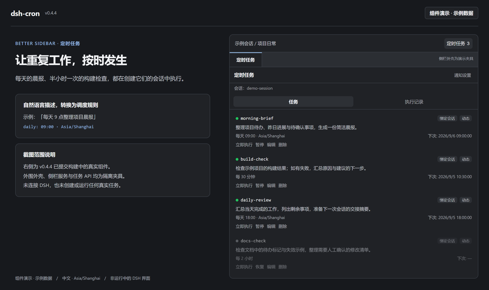
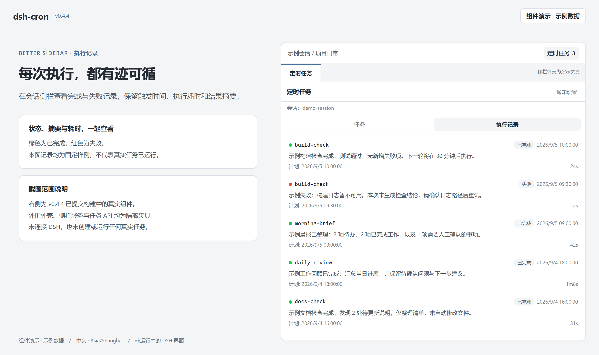
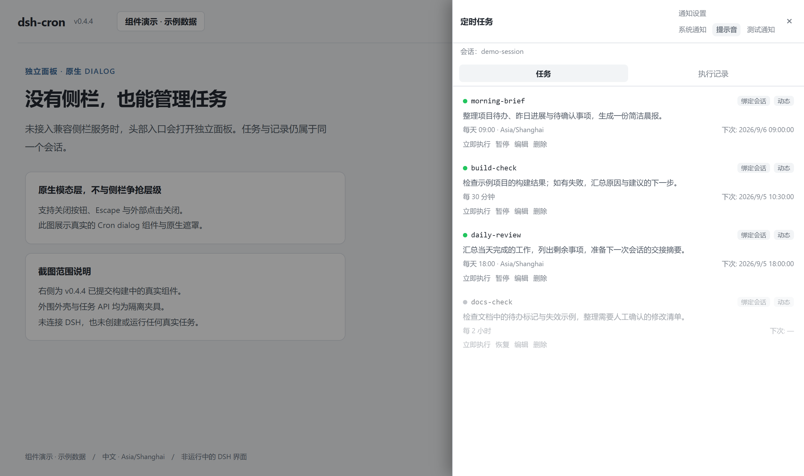

# dsh-cron

**让 DSH 按时回到创建任务的会话，继续替你工作。**

用自然语言创建定时任务，在 Better Sidebar 中管理任务和执行记录；没有兼容的 Sidebar 时，自动回退到独立面板。到点使用原会话的模型配置执行，结果仍回到原会话。

[](https://github.com/cloga/dsh-cron/actions/workflows/ci.yml)
[](https://github.com/cloga/dsh-cron/releases/latest)
[](LICENSE)


[快速安装](#安装与升级) · [使用方式](#使用方式) · [界面预览](#界面预览) · [常见问题](#常见问题) · [开发与发布](#开发与发布)

**English:** Session-bound scheduled prompts for DeepSeek Harness. Create tasks in chat, manage them in an optional Better Sidebar tab or a standalone dialog, and receive results in the owning conversation. Ships prebuilt client code; no install scripts. Important changes are version-gated and automatically released after main-branch CI succeeds.

## 核心能力

| 能力 | 你可以做什么 |
| --- | --- |
| 自然语言调度 | 一次性、固定间隔、每天、标准五段 cron；`daily` / `cron` 支持 IANA 时区 |
| Sidebar 内管理 | 查看任务、编辑、立即执行、暂停/恢复、删除，并切换到执行记录 |
| 可选集成与回退 | 复用已有 Cron 标签页，展开所在面板；服务缺失、禁用或不兼容时使用独立 modal |
| 严格会话归属 | 工具和 HTTP 操作按 root Session 隔离；原会话暂不可用时保留待执行任务，不投递给其他会话 |
| 执行可追踪 | 记录投递、运行、完成、失败及中断状态，提供耗时与结果摘要 |
| 多层通知 | 未读徽标、页面 Toast、提示音、浏览器通知，以及受平台支持的 Host 原生通知 |
| 可验证交付 | 固定版本安装、不可变 GitHub Release、SHA-256 校验和受保护的自动发布流程 |

## 界面预览

> 以下图片使用 **v0.4.4 的真实 Cron Client bundle 和 React 组件**渲染。外围页面、Better Sidebar 容器及任务 API 均为隔离演示，使用示例数据；不是用户真实会话截图，也不代表本机部署已更新。可点击图片查看原尺寸。[截图来源与复现方式](docs/images/README.md)

### 定时任务：融入 Sidebar，不再另占一个右侧抽屉



从会话头部的 **「定时任务 / Scheduled tasks」** 按钮进入；已有标签页会被复用。所在的右侧面板、底部面板或窄屏抽屉会按需展开，已分离的浮窗不会额外展开其他面板。

<details>
<summary><strong>查看执行记录（浅色主题）</strong></summary>



任务与历史属于各自的 Session；隐藏标签页停止面板轮询，过期响应不会覆盖切换后的会话。通知偏好收纳在面板头部的「通知设置」中。

</details>

<details>
<summary><strong>查看没有 Sidebar 时的独立面板</strong></summary>



独立面板使用浏览器原生 modal/top layer，支持 Escape、点击外部关闭和焦点恢复，不再靠无限提高 `z-index` 与其他插件争抢层级。

</details>

**版本提示：** 可选 Sidebar 集成从 **v0.4.4** 起发布；v0.4.3 中与 Sidebar 相关的改动仅为收回按钮兼容修复。Better Sidebar 的 **Tasks 子代理页不是 Cron 定时任务页**，也不会因为刷新旧版本而自动变成定时任务页。

## 安装与升级

### 1. 安装固定版本

在常驻的 **Web / Desktop Web Profile** 中安装：

```sh
dsh plugin --profile web add github:cloga/dsh-cron#v0.4.4
```

已安装旧版时使用同一条 `add` 命令升级，**无需先卸载**。不带 tag 的 GitHub 安装会跟随移动的默认分支，不作为发布验证依据。

也可以从 [v0.4.4 Release](https://github.com/cloga/dsh-cron/releases/tag/v0.4.4) 下载 `dsh-cron-0.4.4.tgz` 与 `SHA256SUMS`，校验后安装本地包：

```sh
dsh plugin --profile web add ./dsh-cron-0.4.4.tgz
```

`lib/client.js` 已随包提交，**无 `prepare` / `postinstall` 等安装脚本**，不需要为本插件授权安装期构建。

<details>
<summary>Windows Desktop：如果 dsh 快捷命令指向了损坏的旧安装</summary>

在使用默认安装目录的 Desktop 环境，可以用 PowerShell 直接调用其自带 CLI，绕过失效的 PATH shim；若安装路径不同，请先确认实际路径，不要盲目重装或改全局 PATH。

```powershell
$cli = "$env:APPDATA\io.github.hairyf.deepseek-harness-desktop\dependencies\dsh\node_modules\@deepseek-ai\dsh\lib\bin.js"
node $cli plugin --profile web add 'github:cloga/dsh-cron#v0.4.4'
```

</details>

### 2. 核对安装版本

默认 DSH Home 下可直接读取安装清单，不经过可能触发配置协调的 `dsh plugin list`：

```sh
pnpm --dir "$HOME/.dsh/profiles/web" list dsh-cron --depth 0
```

应显示 `dsh-cron@0.4.4`。若设置了自定义 `DSH_HOME`，请替换为其实际 Profile 目录。

### 3. 在安全时机激活

等运行中的 Session 结束后，重启对应的 DSH Host / Desktop，再硬刷新页面（Ctrl/Cmd+Shift+R）。**不要为插件升级打断正在执行的会话。**

安装、当前进程加载和页面生效是不同状态：仅更新仓库或安装文件，不意味着已经运行新 Client bundle。

## 使用方式

### 在会话里描述计划

例如：

> 每个工作日北京时间早上 9 点，总结这个项目的进展和待办。使用 Asia/Shanghai 时区。

> 每隔 30 分钟检查一次构建结果，有失败就告诉我。

Agent 会通过工具创建任务。到点后提示词注入**创建任务的会话**；Agent 忙时排队，不并发重叠。动态任务持久化到 DSH Home，不能通过其他 Session 的管理入口读写。

| 调度规则（每项任务四选一） | 示例 | 说明 |
| --- | --- | --- |
| `at` | `2026-10-01T09:00:00+08:00` | 一次性 ISO 8601 时刻，建议显式带时区偏移 |
| `every` | `1800` | 固定间隔秒数；最小 10 秒，每次执行都可能产生模型费用 |
| `daily` | `09:00` | 指定时区的每日时刻 |
| `cron` | `0 9 * * 1-5` | 分、时、日、月、星期；例为工作日 09:00 |

`daily` / `cron` 的 `timeZone` 使用 IANA 名称，例如 `Asia/Shanghai`。未指定时采用插件 `defaultTimeZone`，**默认是 UTC**，不要把它当成本机时区。默认调度检查间隔为 15 秒，不是硬实时系统。

### 用面板管理和追踪

点击会话头部的「定时任务」，在 **任务** 与 **执行记录** 间切换。兼容的 Better Sidebar 会承载面板；否则自动使用独立面板。跨会话的旧通知会打开注明原 Session 的独立面板，不把原会话任务塞进当前侧栏，也不会静默切换会话。

模型工具：`cron_list`、`cron_add`、`cron_update`、`cron_remove`、`cron_history`。它们只接受当前 live root Session 的所有权；子代理或无 Agent 的调用会被拒绝。

### 通知与历史

| 通道 | 适用场景 / 开关 |
| --- | --- |
| 未读徽标 | 当前页面；打开面板后清零 |
| 页面 Toast | 完成后自动消失，失败提示保留；点击可查看对应执行记录 |
| 提示音 | 「通知设置」中切换；浏览器可能要求先有用户交互 |
| 浏览器系统通知 | 需要通知授权；页面在后台时可用，不等于关闭浏览器后仍能送达 |
| Host 原生通知 | 支持 macOS / Linux 平台通知命令；`systemNotify` / `systemNotifySound` 可控制；Windows 当前无此原生通道 |

历史最多保留 500 条记录。重启恢复会将遗留的非终态记录标为 `interrupted`，不会重新触发已消费的计划；原会话恢复失败时，逾期任务保留并等待后续重试。

## 兼容性与安全边界

| 项目 | 支持范围 |
| --- | --- |
| DSH Core | 受控 `0.1.1-rc.2`、官方 `0.1.2-rc.1`、官方 `0.1.3-alpha.1`；不承诺范围外版本兼容 |
| Better Sidebar | **可选**；按 `0.18.0` 的公开 Client Service 合同验证，并进行版本/能力检测；缺失、不兼容、禁用或卸载时回退 |
| Profile | 常驻 Web / Desktop Web；一次性 headless 进程不提供未来持续调度保证 |
| Node.js / 开发包管理器 | `^22.19.0 || >=24.0.0` / `pnpm@11.7.0` |
| 界面 | 中英文、亮暗主题、桌面和窄屏；使用 DSH 主题 token |

- **真实执行与费用**：触发的是原 Session 的模型调用，使用该会话的模型配置和可用工具权限。不要给无人值守任务超出预期的发布、删除或 Shell 权限。
- **所有权隔离**：工具和 HTTP 操作都按 Session 校验；冷恢复只针对原 root Session，拒绝恢复子代理所有的 Session，不会退到其他会话。
- **本地数据**：默认保存 `$DSH_HOME/cron-tasks.json` 与 `$DSH_HOME/cron-history.jsonl`，路径可配置；测试不应使用真实任务和凭据。
- **HTTP 边界**：`/cron/api/*` 做 loopback/trusted-host、同源及 owner 校验，但不是面向恶意本机进程的身份认证协议。
- **常驻要求**：Host 必须保持运行。`coldWake` 恢复的是被卸载的会话，不是唤醒关机或休眠的电脑。

<details>
<summary>主要配置项与进一步说明</summary>

配置 schema 见 [`index.js`](index.js)。共享调度服务应挂在 Host Profile，而不是随意放进单个 Agent preset；修改组合前阅读相关 Cordis composition 指南。

| 配置项 | 默认值 / 用途 |
| --- | --- |
| `tickSeconds` | `15`，调度检查周期 |
| `defaultTimeZone` | `UTC`，`daily` / `cron` 默认时区 |
| `coldWake` | `true`，尝试恢复原会话 |
| `systemNotify` / `systemNotifySound` | `true`，Host 原生通知与声音（受平台支持限制） |
| `storagePath` / `historyPath` | 空值表示使用 DSH Home 下的默认文件 |
| `tasks` | 静态任务列表，每项必须显式设置 root `sessionId`；动态任务更适合通过会话工具创建 |

Core 0.1.3 使用 snapshot header 与可关闭的 read handle；旧 Core 使用其既有读取接口。读取或关闭失败不会降级到错误的会话。更深的 DST/跨时区性质测试仍属于后续工作，不把现有覆盖描述为所有边界条件的保证。

</details>

## 常见问题

**安装后为何看不到定时任务标签页？** 先确认安装的是 v0.4.4 或后续兼容版本，并已激活新 Client bundle；再检查 Better Sidebar 服务版本/能力以及 Cron 标签页是否启用。头部按钮仍然保留，用它进入任务页。若条件不满足，出现独立面板是正常回退，不是数据丢失。

**Sidebar 展开后收回按钮消失？** v0.4.3 起附带针对 `dsh-tauri 0.6.7` 全局标签选择器冲突的局部样式兼容修复，仅恢复 Better Sidebar 的原生控件，不修改左侧导航。v0.4.4 也包含该修复。

**为什么任务没有立刻执行？** 检查 Host 是否常驻、任务时区/下次执行时间、任务是否暂停、原会话是否可恢复以及 Agent 是否正忙。不要将“已投递”当成“已完成”。

**合并 PR 后为什么安装的旧版本没有变化？** 合并、发布、安装、激活是四个步骤。功能需被包含在新 Release 中，再安装固定版本并安全激活；单纯刷新不能取得未安装的功能。

## 开发与发布

代理和维护者先读 [`AGENTS.md`](AGENTS.md)。[架构与验证地图](docs/agentic-readiness.md)解释入口、会话不变量、测试层级和故障恢复；[发布手册](RELEASE.md)规定交付责任。

```sh
pnpm install --frozen-lockfile
pnpm verify                       # 类型、构建、Host/Client、发布策略及打包检查
pnpm exec playwright install chromium
pnpm test:sidebar                 # 浏览器回归；独立 fixture，不修改真实 GUI
pnpm test:release                 # 离线发布策略、重试和工作流连接测试
pnpm release:check --base origin/main  # 检查已提交的 PR 候选
```

额外验证：设置 `DSH_CORE_PATH` 后运行 `pnpm test:core`；支持的精确 Core commit 为 `a66e4702047846cdaa10c66c9d3df3951f5ea70d` 与 `d347e703908d0406b7a7ef80e3a0e594d86b2215`。未设置时源码检查会显式跳过，CI 会在 Windows/Linux、Node 22.19/24 上检查这两个基线。设置 `DSH_BETTER_SIDEBAR_PATH` 指向 0.18.0 源码包后，可运行 `node tests/sidebar-contract.test.mjs` 验证真实 reducer/Cordis 合同。截图复现命令见 [图片说明](docs/images/README.md)。

### 重要 PR 的发布闭环

```text
PR：新版本 + changelog + 安装说明
  → release-policy + 全平台测试 + 浏览器测试
  → release-ready（主分支必需检查）
  → 合并 → 主分支 CI → 自动发布注释 tag 与不可变 Release
  → 官方包摘要校验 + 隔离安装验证 → 交付说明
```

重要运行时、依赖、构建或发布流程变更必须在同一 PR 中递增版本。主分支要求 PR、保持最新及 `release-ready` 成功，管理员同样受约束；发布失败不能用绕过检查或覆盖 tag/资产来解决。代理须持续跟进到发布及产物核验完成，不等用户再次提醒。

**纯文档/测试变更可明确说明无需新版本**；本 README 与配图更新即属此类，不会改写已发布的 v0.4.4 产物。需要重试发布时，重跑原提交的主分支 CI，不能另开绕过全平台测试的发布入口。

---

[更新日志](CHANGELOG.md) · [问题反馈](https://github.com/cloga/dsh-cron/issues) · [发行版本](https://github.com/cloga/dsh-cron/releases) · [上游项目](https://github.com/ZhuoSir/dsh-cron)

[MIT](LICENSE) © 2026 dsh-cron contributors
