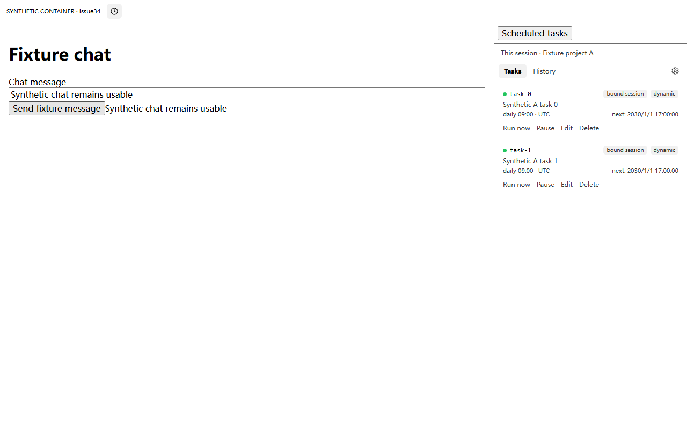
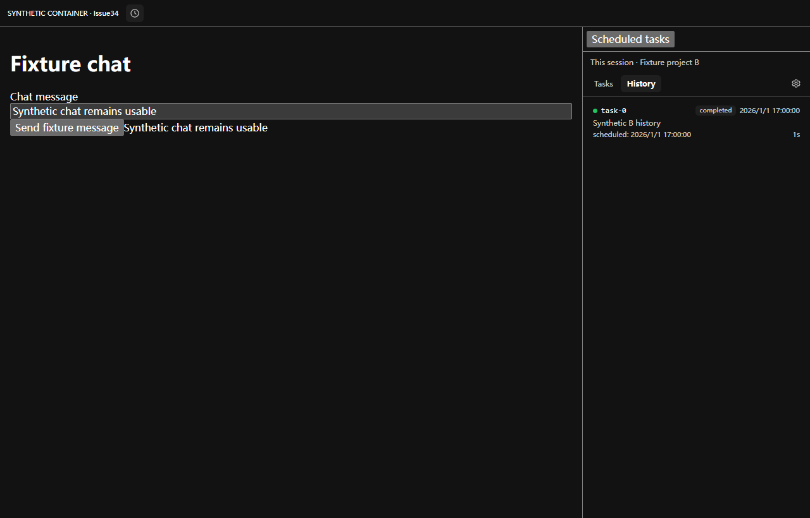
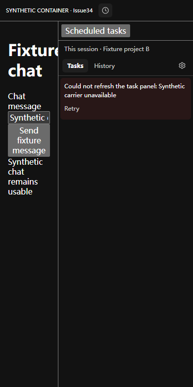

# dsh-cron

**让 DSH 按时回到创建任务的会话，继续替你工作。**

用自然语言创建定时任务，在 **DSH 官方 Sidebar 的当前会话标签**中管理任务和执行记录，边聊天边查看进展。原生能力不可用时保留兼容的 Better Sidebar / 独立面板回退。到点使用原会话的模型配置执行，结果仍回到原会话；不新增跨会话任务总览。

[](https://github.com/cloga/dsh-cron/actions/workflows/ci.yml)
[](https://github.com/cloga/dsh-cron/releases/latest)
[](LICENSE)


[快速安装](#安装与升级) · [使用方式](#使用方式) · [界面预览](#界面预览) · [常见问题](#常见问题) · [开发与发布](#开发与发布)

**English:** Session-bound scheduled prompts for DeepSeek Harness. Create tasks in chat, manage the current session's tasks/history in the official native Sidebar, and receive results in the owning conversation. The header clock selects the same native destination without blocking chat; older or unavailable native surfaces retain the optional Better Sidebar / standalone fallback. No cross-session task center or scheduling-policy change. Ships prebuilt client code; no install scripts. Important changes are version-gated and automatically released after main-branch CI succeeds.

## 核心能力

| 能力 | 你可以做什么 |
| --- | --- |
| 自然语言调度 | 一次性、固定间隔、每天、标准五段 cron；`daily` / `cron` 支持 IANA 时区 |
| Sidebar 内管理 | 查看任务、编辑、立即执行、暂停/恢复、删除，并切换到执行记录 |
| 原生优先与兼容回退 | 时钟选中当前会话已有的原生 Cron 标签，复用官方面板控件；缺少原生能力时再选择兼容的 Better Sidebar 或独立 modal，不重新启用停用插件 |
| 严格会话归属 | 工具和 HTTP 操作按 root Session 隔离；原会话暂不可用时保留待执行任务，不投递给其他会话 |
| 执行可追踪 | 记录投递、运行、完成、失败及中断状态，提供耗时与结果摘要 |
| 多层通知 | 未读徽标、页面 Toast、提示音、浏览器通知，以及受平台支持的 Host 原生通知 |
| 可验证交付 | 固定版本安装、不可变 GitHub Release、SHA-256 校验和受保护的自动发布流程 |

## 界面预览

### v0.5.0：当前会话的官方 Sidebar 标签

```text
会话头部的时钟 → 当前会话的「定时任务」原生标签
                       ├─ 任务：查看 / 编辑 / 运行 / 暂停 / 确认删除
                       ├─ 执行记录
                       └─ 会话详情与通知设置
聊天保持可用；关闭、分栏、浮窗、全屏和尺寸由官方 Sidebar 管理。
```

时钟保持固定大小，悬停提示和读屏描述保留任务数量与未读信息。Cron 内容不重复原生标题/关闭控件；显示可识别的会话标题，完整 ID 放在详情中。未取得标题时明确显示“标题暂不可用”并展开身份详情，不能用一个虚构标题掩盖旧通知所属的会话。

隐藏、卸载或结束的标签停止面板轮询；过期响应不覆盖其他会话。切回已有标签不重复创建页签，任务与历史选择保持会话归属。读取失败提供重试；任务操作有进行中反馈，删除先确认。操作锁是单面板的交互保护，不是后台跨面板全局排他锁。

<details>
<summary><strong>查看可复现的组件集成测试图（不是完整官方 Shell 截图）</strong></summary>

> 以下图片使用 **v0.5.0 的实际预构建 Cron Client 和 React**，驱动未修改的 Core rc.2 registry/controller/store。外部聊天、标签栏和布局是明确标记的 **SYNTHETIC CONTAINER**，API/会话数据为测试样本；不代表真实 GUI 已安装或激活，也不能代替官方完整 Shell 的视觉验收。[来源与复现方式](docs/images/README.md)







</details>

原生能力不可用时，兼容的 Better Sidebar 仍可承载内容；否则保留浏览器原生 modal/top-layer 回退，支持 Escape、点击外部关闭和焦点恢复。跨会话旧通知使用注明原会话的安全回退，不静默切换当前会话。

**版本提示：** Better Sidebar 可选集成从 v0.4.4 起发布，官方原生 Sidebar 集成从 **v0.5.0** 起提供。Better Sidebar 的子代理 **Tasks** 页不是 Cron 定时任务页，刷新旧版本也不会取得新功能。

## 安装与升级

### 1. 安装固定版本

在常驻的 **Web / Desktop Web Profile** 中安装：

```sh
dsh plugin --profile web add github:cloga/dsh-cron#v0.5.2
```

已安装旧版时使用同一条 `add` 命令升级，**无需先卸载**。不带 tag 的 GitHub 安装会跟随移动的默认分支，不作为发布验证依据。

也可以从 [v0.5.2 Release](https://github.com/cloga/dsh-cron/releases/tag/v0.5.2) 下载 `dsh-cron-0.5.2.tgz` 与 `SHA256SUMS`，校验后安装本地包：

```sh
dsh plugin --profile web add ./dsh-cron-0.5.2.tgz
```

`lib/client.js` 已随包提交，**无 `prepare` / `postinstall` 等安装脚本**，不需要为本插件授权安装期构建。

<details>
<summary>Windows Desktop：如果 dsh 快捷命令指向了损坏的旧安装</summary>

在使用默认安装目录的 Desktop 环境，可以用 PowerShell 直接调用其自带 CLI，绕过失效的 PATH shim；若安装路径不同，请先确认实际路径，不要盲目重装或改全局 PATH。

```powershell
$cli = "$env:APPDATA\io.github.hairyf.deepseek-harness-desktop\dependencies\dsh\node_modules\@deepseek-ai\dsh\lib\bin.js"
node $cli plugin --profile web add 'github:cloga/dsh-cron#v0.5.2'
```

</details>

### 2. 核对安装版本

默认 DSH Home 下可直接读取安装清单，不经过可能触发配置协调的 `dsh plugin list`：

```sh
pnpm --dir "$HOME/.dsh/profiles/web" list dsh-cron --depth 0
```

应显示 `dsh-cron@0.5.2`。若设置了自定义 `DSH_HOME`，请替换为其实际 Profile 目录。

### 3. 在安全时机激活

等运行中的 Session 结束后，重启对应的 DSH Host / Desktop，再硬刷新页面（Ctrl/Cmd+Shift+R）。**不要为插件升级打断正在执行的会话。**

安装、当前进程加载和页面生效是不同状态：仅更新仓库或安装文件，不意味着已经运行新 Client bundle。

## 使用方式

### 在会话里描述计划

例如：

> 每个工作日北京时间早上 9 点，总结这个项目的进展和待办。使用 Asia/Shanghai 时区。

> 每隔 30 分钟检查一次构建结果，有失败就告诉我。

Agent 会通过工具创建任务。到点后提示词注入**创建任务的会话**；Agent 忙时排队，不并发重叠。动态任务持久化到 DSH Home，不能通过其他 Session 的管理入口读写。

| 调度规则（每项任务四选一） | 示例 | 说明 |
| --- | --- | --- |
| `at` | `2026-10-01T09:00:00+08:00` | 一次性 ISO 8601 时刻，建议显式带时区偏移 |
| `every` | `1800` | 固定间隔秒数；最小 10 秒，每次执行都可能产生模型费用 |
| `daily` | `09:00` | 指定时区的每日时刻 |
| `cron` | `0 9 * * 1-5` | 分、时、日、月、星期；例为工作日 09:00 |

`daily` / `cron` 的 `timeZone` 使用 IANA 名称，例如 `Asia/Shanghai`。未指定时采用插件 `defaultTimeZone`，**默认是 UTC**，不要把它当成本机时区。默认调度检查间隔为 15 秒，不是硬实时系统。

### 用面板管理和追踪

点击会话头部的时钟图标（提示为「定时任务 / Scheduled tasks」），在 **任务** 与 **执行记录** 间切换。v0.5.0 优先使用官方原生 Sidebar；原生能力不可用时才尝试兼容的 Better Sidebar，最后回退独立面板。时钟复用当前会话已观察到的原生标签所在面板，不新增 Guide 卡片，保留 Core 的 Files/Guide 初次打开行为。跨会话旧通知仍使用注明原会话的独立面板，不把 A 会话任务塞进 B 会话侧栏，也不会静默切换会话。

模型工具：`cron_list`、`cron_add`、`cron_update`、`cron_remove`、`cron_history`。它们只接受当前 live root Session 的所有权；子代理或无 Agent 的调用会被拒绝。

**v0.5.1 的冷会话只读查看：** 面板的 HTTP `list/history` 可以读取已保存、且经公开 Header 验证为 root 的原会话任务。不会为查看列表恢复 Agent、读取会话事件、消费过期时刻或修改任务状态；未知、子代理或歧义身份仍拒绝。HTTP 修改、启停、立即执行仍要求该 root Session 已加载。读失败会显示错误与重试，不会冒充“没有任务”，也无需重新创建已有任务。

**v0.5.2 的恢复与轮询加固：** 同一冷会话的恢复失败共用 30、60、120、240、300 秒退避，之后最多每 300 秒重试一次（由现有调度 tick 检查，不新增重试定时器）。修好 preset 后会自动重试；若原 root 已重新加载，下次 tick 可直接使用它。等待恢复不会阻塞其他会话，成功投递过的时刻不重放。日志仅记录阶段、会话标识和重试间隔，不回显可能含提示词或凭据的 schema 错误。此退避不修复 preset，也不代表任务业务执行成功。

冷会话 HTTP 读取优先使用公开的 `sessionPersistence.stat(id, { signal })`；旧 Core 无此能力时才回退 metadata-only `list()`。同一 owner 的并发 `list/history` 共用尚未完成的查询，不缓存已完成的所有权判定；后续读取重新验证 root 身份。最后一个请求取消时转发取消信号；若旧后端忽略取消，未完成扫描不会被反复创建，后续读取明确报错并等待该扫描结束。

面板及通知观察器各自只保留一个未完成的只读刷新，慢响应不会被下一轮轮询作废；30 秒截止后取消请求，提供失败反馈和后续重试。隐藏面板、切换 owner 或卸载会取消相应读取，旧响应不回写；任务修改请求不会被自动重放。仓库或 Release 中的改动不等于已安装或当前页面已生效，须分别核对安装及激活状态。

### 通知与历史

| 通道 | 适用场景 / 开关 |
| --- | --- |
| 未读徽标 | 当前页面；打开面板后清零 |
| 页面 Toast | 完成后自动消失，失败提示保留；点击可查看对应执行记录 |
| 提示音 | 「通知设置」中切换；浏览器可能要求先有用户交互 |
| 浏览器系统通知 | 需要通知授权；页面在后台时可用，不等于关闭浏览器后仍能送达 |
| Host 原生通知 | 支持 macOS / Linux 平台通知命令；`systemNotify` / `systemNotifySound` 可控制；Windows 当前无此原生通道 |

历史最多保留 500 条记录。重启恢复会将遗留的非终态记录标为 `interrupted`，不会重新触发已消费的计划；原会话恢复失败时，逾期任务保留并等待后续重试。

## 兼容性与安全边界

| 项目 | 支持范围 |
| --- | --- |
| DSH Core | 保留受控 `0.1.1-rc.2`、官方 `0.1.2-rc.1`、`0.1.3-alpha.1`；v0.4.7 新增精确 `0.1.5-alpha.1` / `0.1.5-alpha.2` 冷恢复读结果适配，v0.4.8 新增官方精确 `0.1.5-rc.2`。下文区分源码合同、fixture 与真实 Host 验证；不承诺整个 0.1.5 系列兼容 |
| 官方 Sidebar | v0.5.0 使用公开 registry + keyed body Slot；精确 `0.1.5-alpha.1` / `alpha.2` / `rc.2` 的原生模型合同可执行验证，缺少原生服务的旧基线走回退，不推断其他版本 |
| Better Sidebar | **可选的次级回退**；按 `0.18.0` 的公开 Client Service 合同验证；不为原生集成重新启用它，缺失/禁用时仍可独立面板 |
| Profile | 常驻 Web / Desktop Web；一次性 headless 进程不提供未来持续调度保证 |
| Node.js / 开发包管理器 | `^22.19.0 || >=24.0.0` / `pnpm@11.7.0` |
| 界面 | 中英文、亮暗主题、桌面和窄屏；使用 DSH 主题 token |

- **真实执行与费用**：触发的是原 Session 的模型调用，使用该会话的模型配置和可用工具权限。不要给无人值守任务超出预期的发布、删除或 Shell 权限。
- **所有权隔离**：工具和 HTTP 操作都按 Session 校验；冷恢复只针对原 root Session，拒绝恢复子代理所有的 Session，不会退到其他会话。
- **本地数据**：默认保存 `$DSH_HOME/cron-tasks.json` 与 `$DSH_HOME/cron-history.jsonl`，路径可配置；测试不应使用真实任务和凭据。
- **HTTP 边界**：`/cron/api/*` 做 loopback/trusted-host、同源及 owner 校验，但不是面向恶意本机进程的身份认证协议。
- **常驻要求**：Host 必须保持运行。`coldWake` 恢复的是被卸载的会话，不是唤醒关机或休眠的电脑。

<details>
<summary>主要配置项与进一步说明</summary>

配置 schema 见 [`index.js`](index.js)。共享调度服务应挂在 Host Profile，而不是随意放进单个 Agent preset；修改组合前阅读相关 Cordis composition 指南。

| 配置项 | 默认值 / 用途 |
| --- | --- |
| `tickSeconds` | `15`，调度检查周期 |
| `defaultTimeZone` | `UTC`，`daily` / `cron` 默认时区 |
| `coldWake` | `true`，尝试恢复原会话 |
| `systemNotify` / `systemNotifySound` | `true`，Host 原生通知与声音（受平台支持限制） |
| `storagePath` / `historyPath` | 空值表示使用 DSH Home 下的默认文件 |
| `tasks` | 静态任务列表，每项必须显式设置 root `sessionId`；动态任务更适合通过会话工具创建 |

Core 0.1.3 使用 snapshot header 与可关闭的 read handle，`read()` 返回事件数组；0.1.5-alpha.1/.2 和精确 0.1.5-rc.2 返回 `{ eventState, events }`。v0.4.7 起同时适配两种形状，只读取事件，不修改/转移事件所有权；旧 Core 的 `inspect()` 保持不变。非法 handle/结果、错误 owner 或子代理 header 会拒绝恢复；读取或关闭失败不会降级到错误的会话。更深的 DST/跨时区性质测试仍属于后续工作，不把现有覆盖描述为所有边界条件的保证。

</details>

## 常见问题

**安装后为何看不到定时任务标签页？** 官方原生集成需要 v0.5.0 及其实际加载的新 Client bundle，并且当前 Core 已提供原生 registry、controller 和内容 Slot。用头部时钟进入；没有新增 Guide 卡片，因此首次打开 Sidebar 仍保留 Core 原有默认页。旧 Core 会继续使用兼容 Better Sidebar 或独立面板。不要为了获得新原生标签而重新启用 Better Sidebar，也不要把刷新旧包当作升级。

**Sidebar 展开后收回按钮消失？** v0.4.3 起附带针对 `dsh-tauri 0.6.7` 全局标签选择器冲突的局部样式兼容修复，仅恢复 Better Sidebar 的原生控件，不修改左侧导航。v0.4.4 也包含该修复。

**为什么任务没有立刻执行？** 检查 Host 是否常驻、任务时区/下次执行时间、任务是否暂停、原会话是否可恢复以及 Agent 是否正忙。不要将“已投递”当成“已完成”。

**合并 PR 后为什么安装的旧版本没有变化？** 合并、发布、安装、激活是四个步骤。功能需被包含在新 Release 中，再安装固定版本并安全激活；单纯刷新不能取得未安装的功能。

## 开发与发布

代理和维护者先读 [`AGENTS.md`](AGENTS.md)。[架构与验证地图](docs/agentic-readiness.md)解释入口、会话不变量、测试层级和故障恢复；[发布手册](RELEASE.md)规定交付责任。

```sh
pnpm install --frozen-lockfile
pnpm verify                       # 类型、构建、Host/Client、发布策略及打包检查
pnpm exec playwright install chromium
pnpm test:sidebar                 # 浏览器回归；独立 fixture，不修改真实 GUI
pnpm test:release                 # 离线发布策略、重试和工作流连接测试
pnpm release:check --base origin/main  # 检查已提交的 PR 候选
```

额外验证：设置 `DSH_CORE_PATH` 后运行 `pnpm test:core`。默认要求干净的精确提交 checkout；可另设 `DSH_CORE_REF` 为下列 SHA 或指向它的 tag，以 `git show` 只读验证 immutable blobs，不切换、清理或安装现有 Core 仓库。

| Core | 精确源码 SHA |
| --- | --- |
| 0.1.2-rc.1 | `a66e4702047846cdaa10c66c9d3df3951f5ea70d` |
| 0.1.3-alpha.1 | `d347e703908d0406b7a7ef80e3a0e594d86b2215` |
| 0.1.5-alpha.1 | `5dda764ed3aa172535a7967b06ff95d9cbfe536a` |
| 0.1.5-alpha.2 | `b2e3b2a0125854567a4a5fcba75782e42fe84901` |
| 0.1.5-rc.2 | `fb2c4b9e698e30edb738bca4cf0618587db7d203` |

未设置 `DSH_CORE_PATH` 时只验证包声明并显式跳过源码检查。CI 在 Windows/Linux、Node 22.19/24 上检查五个精确基线。源码验证检查真实返回类型；上述三个精确 0.1.5 版本额外验证 header utilities/session 与 shell overlay/root 的 Slot 声明，并执行各自 Git 源码的 JSONL handle 类接入 Cron 冷恢复（fake storage/AgentRegistry），覆盖两种 eventState、空/非空事件、current/primed 切片、preset/model、幂等关闭和关闭后拒绝读取。rc.2 的 persistence 与 JSONL handle 源码相对 alpha.2 未变，保留已有双形状运行时适配，无需 RuntimeClient 改写。这不是完整 Core 启动、JSONL 文件迁移/IO、真实模型或已安装 Host/GUI 验证，不把 API 名称检查称为全面兼容。

v0.5.0 的 `tests/official-sidebar-contract.test.mjs` 还执行上述三个精确 0.1.5 版本的原生 registry/controller/domain/store/dockkit planner；更旧两条源码基线没有原生 API，明确跳过原生用例而保留回退验证。浏览器用实际 Cron 构建、上述 rc.2 模型和合成容器检查导航、归属、分栏、状态与清理，并不加载完整官方 renderer 或代表用户 GUI 已更新。CI/Release 为浏览器明确提供 rc.2 源码，不能以缺少源码的跳过结果代替这一门禁。

设置 `DSH_BETTER_SIDEBAR_PATH` 指向 0.18.0 源码包后，可运行 `node tests/sidebar-contract.test.mjs` 验证旧可选 reducer/Cordis 合同；不用安装或启用该插件。截图复现命令见 [图片说明](docs/images/README.md)。

### 重要 PR 的发布闭环

```text
PR：新版本 + changelog + 安装说明
  → release-policy + 全平台测试 + 浏览器测试
  → release-ready（主分支必需检查）
  → 合并 → 主分支 CI → 自动发布注释 tag 与不可变 Release
  → 官方包摘要校验 + 隔离安装验证 → 交付说明
```

重要运行时、依赖、构建或发布流程变更必须在同一 PR 中递增版本。主分支要求 PR、保持最新及 `release-ready` 成功，管理员同样受约束；发布失败不能用绕过检查或覆盖 tag/资产来解决。代理须持续跟进到发布及产物核验完成，不等用户再次提醒。

**纯文档/测试变更可明确说明无需新版本**；实际 UI 行为变更（如 v0.4.5 的紧凑面板）则必须发布新版本，不能覆盖旧 tag 或产物。需要重试发布时，重跑原提交的主分支 CI，不能另开绕过全平台测试的发布入口。

---

[更新日志](CHANGELOG.md) · [问题反馈](https://github.com/cloga/dsh-cron/issues) · [发行版本](https://github.com/cloga/dsh-cron/releases) · [上游项目](https://github.com/ZhuoSir/dsh-cron)

[MIT](LICENSE) © 2026 dsh-cron contributors
